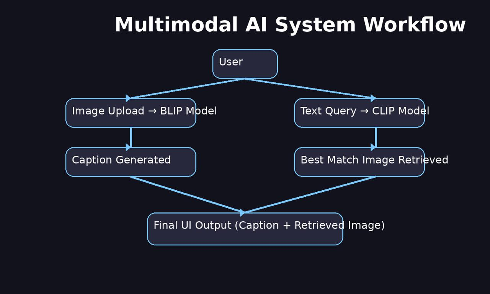
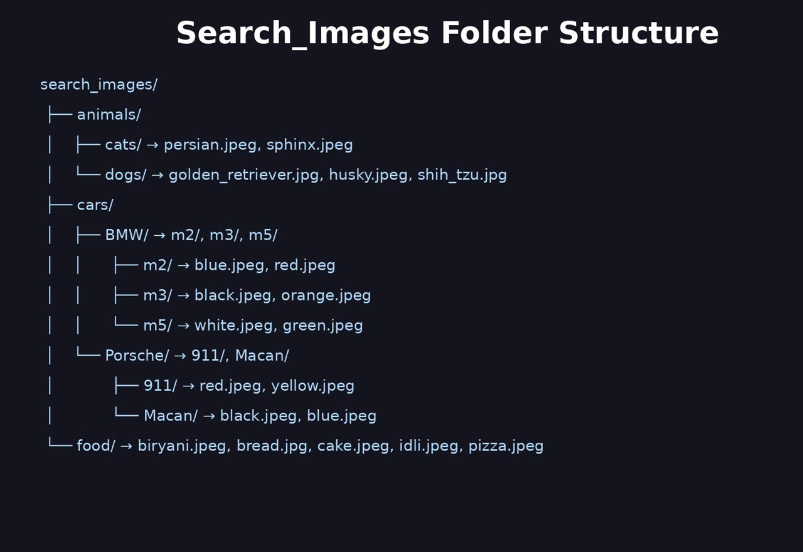
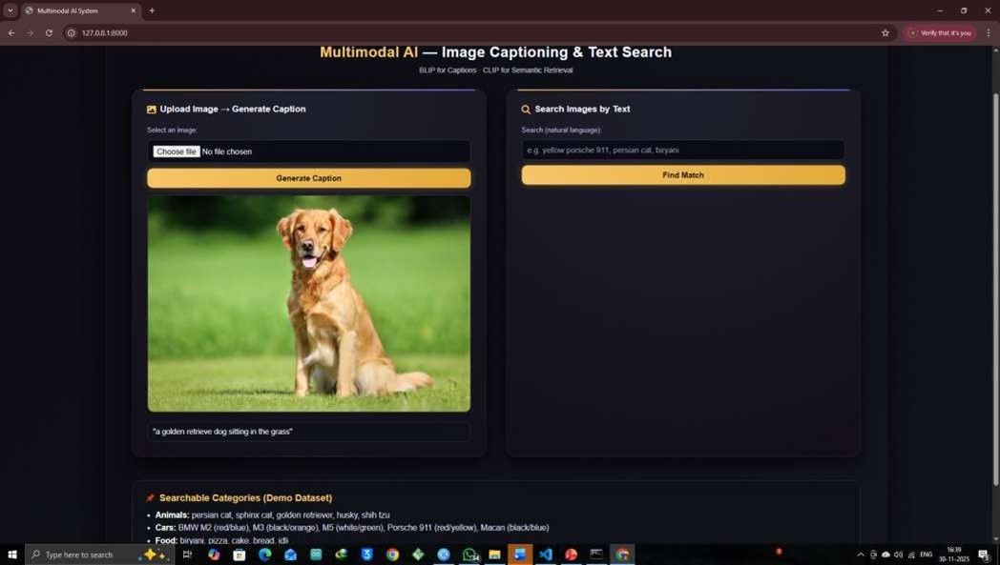
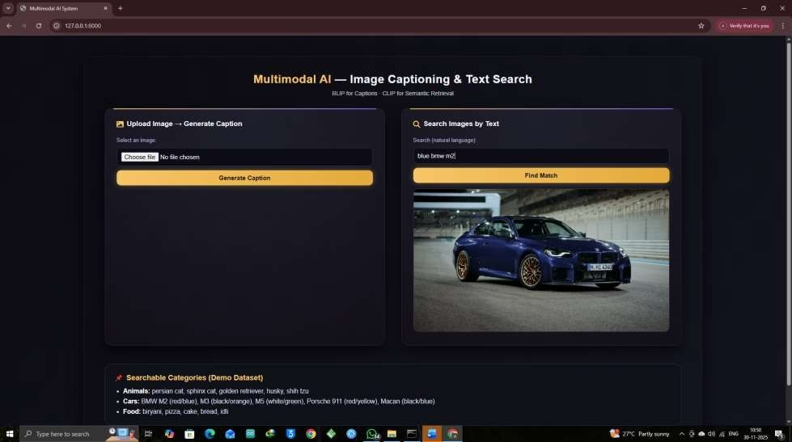

Multimodal AI — Image Captioning & Text-Based Image Retrieval
__________________________________________________________________________________________________________________________________________

✅This project demonstrates a multimodal AI system capable of understanding both visual and textual input.
It performs image → caption generation and text → image retrieval, using transformer-based models (BLIP and CLIP) through Hugging Face + PyTorch, served via Django.

The goal was to build a working mini-system that connects computer vision and natural language processing in a single interface.

__________________________________________________________________________________________________________________________________________

What the System Can Do
	•	Upload an image → it generates a natural-language caption
	•	Type a text query → it returns the most relevant image available in the dataset
	•	Uses vector similarity to compare meaning between text and images
	•	Runs through a web interface built using Django + HTML/CSS

This makes it useful for tasks like visual search, accessibility, dataset exploration, catalogue indexing, and general multimodal experimentation.

_________________________________________________________________________________________________________________________________________

Architecture Overview

⸻

Folder Structure (Dataset)

Images used for CLIP retrieval follow a hierarchical structure:

This structure helps the retrieval model distinguish categories and variations more easily.

⸻

Models Used

Model    	                                          Purpose
BLIP (Salesforce/blip-image-captioning-base)	      Generates captions from images
CLIP (openai/clip-vit-base-patch32)	                  Converts text + images into vectors & finds similarity

Both models are transformer-based — meaning they use attention mechanisms instead of sequential processing like RNNs. This is what allows them to understand image features + textual meaning at a high level.

__________________________________________________________________________________________________________________________________________

Tech Stack
	•	Python
	•	Django (backend + routing)
	•	PyTorch
	•	Hugging Face Transformers
	•	BLIP + CLIP
	•	HTML / CSS (custom UI)

_________________________________________________________________________________________________________________________________________
Installation & Run

git clone <repository-link>
cd multimodal-ai
pip install pillow
pip install transformers
pip install torch
python manage.py runserver

Now open:

http://127.0.0.1:8000/

⸻

Screenshots

Notes / Limitations
	•	First run may take time — model weights download (~1–1.5GB combined)
	•	Retrieval depends on dataset variety and structure
	•	Can be expanded with more categories or generative models later
________________________________________________________________________________________________________________________________

Possible Future Extensions
	•	Add Stable Diffusion → convert text into generated images
	•	Voice input → speech-to-text multimodality
	•	Real-time webcam captioning
